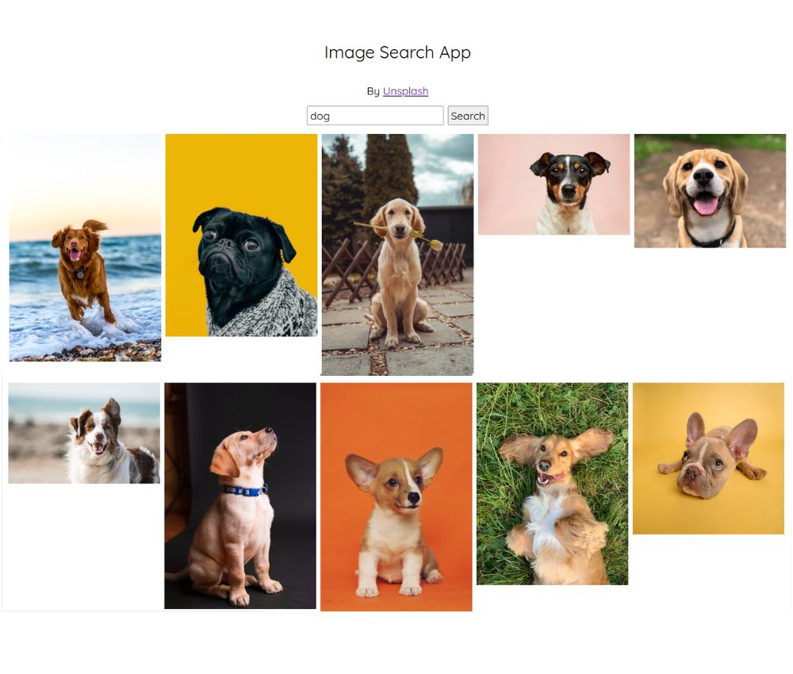

# Unsplash Clone / Image Search 🔍
## Mini Application for API Fetch / React Vite Practice

### Tools I used
  
  
  
  
  
  
  

This repository contains information about the API used in the development of an Unsplash clone application.

## Unsplash API

The Unsplash API provides access to a vast collection of high-quality images, offering various endpoints to search, retrieve, and manage photos.  
Detailed information about available endpoints, parameters, authentication, and data formats can be found in the official documentation on [Unsplash API](https://unsplash.com/documentation).

## API Features

- **Endpoints:** Explore various endpoints available for photo search, photo retrieval, collections, etc.
- **Parameters:** Learn about parameters used in API requests to customize search queries.
- **Authentication:** Understand authentication methods (if any) required to access the API.
- **Data Formats:** Get information on the data formats (JSON, XML, etc.) returned by the API.   
 

### Built using React with Vite
Harnessing Vite's rapid development environment for efficient code compilation and development speed.

### Deployed on Vercel
Leveraging its seamless hosting platform to ensure scalability, reliability, and superior performance for end users.   

Explore a vast collection of stunning images!   
Get inspired and find high-quality photos for your projects.   
📸 Discover now on [Unsplash Clone](https://unsplash-clone-yukosuga.vercel.app/)